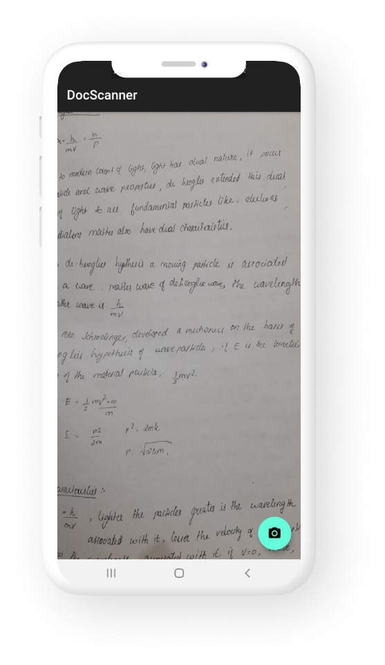
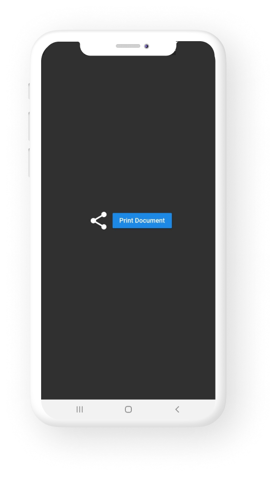
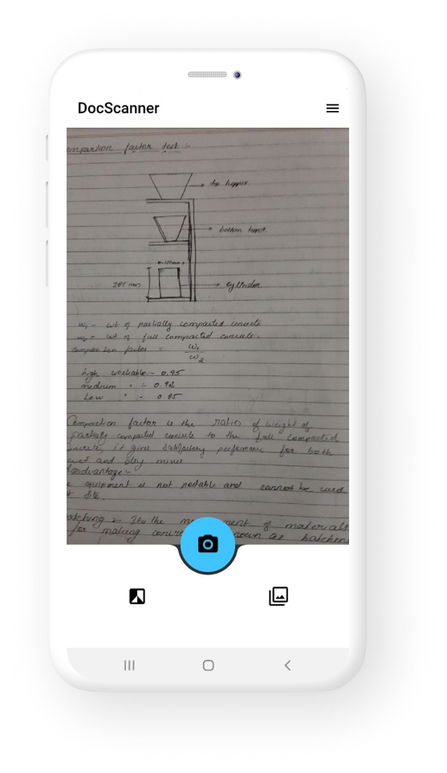
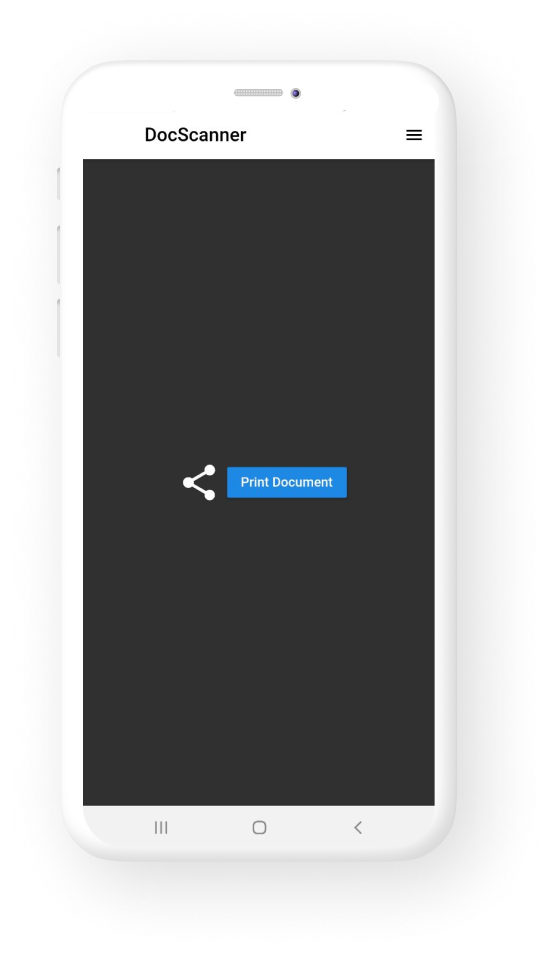

:bird: Flutter App to scan document and share as pdf.(v1.0.0 Beta)

## :dart:Done

* Takes picture.
* Saves the image in temporary location.
* saves as pdf.
* share and print option.

## :dart:ToDo
                                       
* Process the image to greyscale.
* multiple photo selection.
* Edge detection.

## Phase-1

         

  
  
## Phase-2

         

[Download v1.0.0 Beta APK here](https://github.com/Aman-zishan/DocScanner/raw/master/DocScanner.apk)

## This app is under development
