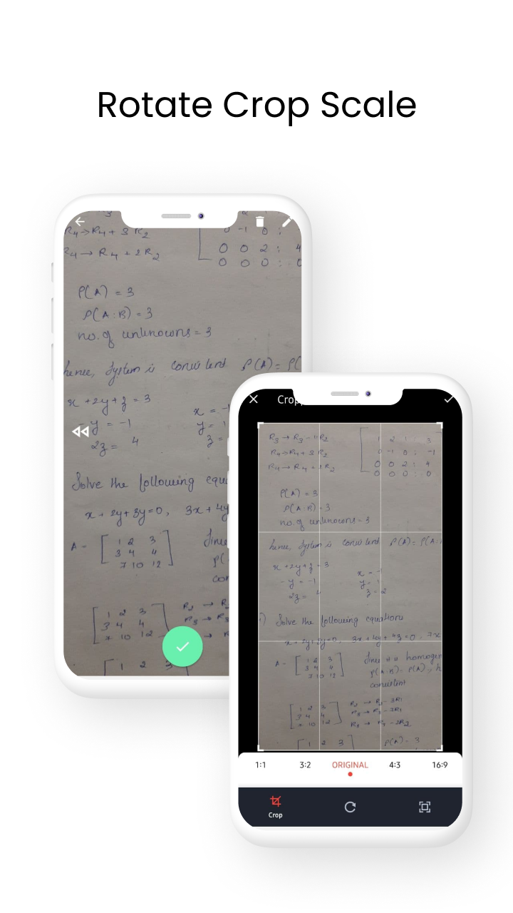

  

:bird: Flutter App to scan document and share as pdf.

### Latest release : v1.0.0-Beta

# Downloads:

Please do check the [releases](https://github.com/Aman-zishan/DocScanner/releases) for the source code along with APK version of earlier versions.

## :dart:Done

* Takes picture.
* Saves the image in temporary location.
* saves as pdf.
* share and print option.
* Process the image to greyscale.

## :dart:ToDo
                                       
* multiple photo selection.
* Edge detection.
* Bug fixes

## v1.0.0-Beta

                        

## Contribution

Go through the [guidelines](https://github.com/Aman-zishan/DocScanner/blob/master/CONTRIBUTING.md) and feel free to contribute to this open source project!

