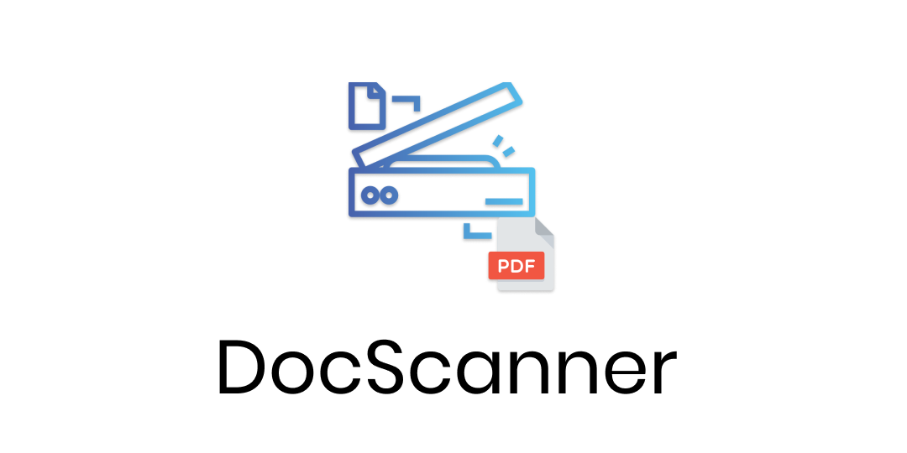

Flutter App to scan document and share as pdf.(v1.0.0 Beta)

## :dart:Done

* Takes picture.
* Saves the image in temporary location.
* saves as pdf.
* share and print option.

## :dart:ToDo
                                       
* Process the image to greyscale.
* multiple photo selection.
* Edge detection.

## Phase-1

         

  
  
## Phase-2

         

[Download v1.0.0 Beta APK here](https://github.com/Aman-zishan/DocScanner/raw/master/DocScanner.apk)

## This app is under development

## Contribution

Hacktoberfest® is open to everyone in our global community. Whether you’re a developer, student learning to code, event host, or company of any size, you can help drive growth of open source and make positive contributions to an ever-growing community. All backgrounds and skill levels are encouraged to complete the challenge.

Go through the [guidelines](https://github.com/Aman-zishan/DocScanner/blob/master/CONTRIBUTING.md) and feel free to contribute to this open source project!

